# NETFLIX.sub - Subscription Management System
## Detailed Technical Report: Transaction & Payment Architecture

---

## Table of Contents

0. [Class Diagram](#class-diagram)
1. [3.1 Transaction Class (Encapsulation & Entity Mapping)](#31-transaction-class-encapsulation--entity-mapping)
2. [3.2 Transaction Type Enum (Enumerated Types)](#32-transaction-type-enum-enumerated-types)
3. [3.3 Transaction Service (Business Logic Layer)](#33-transaction-service-business-logic-layer)
4. [3.4 Transaction Repository (Data Access Layer)](#34-transaction-repository-data-access-layer)
5. [3.5 Transaction Controller (REST API Layer)](#35-transaction-controller-rest-api-layer)
6. [3.6 Report Service (Analytics using Streams)](#36-report-service-analytics-using-streams)
7. [3.7 Transaction DTO (Data Transfer Object)](#37-transaction-dto-data-transfer-object)

---

## Class Diagram

```mermaid
classDiagram
    direction TB

    %% ─────────────────── ENTITY / MODEL CLASSES ───────────────────

    class Payment {
        +String paymentId
        +String userId
        +String subId
        +double amount
        +String cardLast4
        +Instant createdAt
        +String status
        +String failureReason
        +Payment(userId, subId, amount, cardLast4, status, reason)
        +Payment(paymentId, userId, subId, amount, cardLast4, status, reason, createdAt)
        +toString() String
    }

    class Invoice {
        +String invoiceId
        +String userId
        +String subId
        +String paymentId
        +double amount
        +Instant issuedAt
        +Invoice(userId, subId, paymentId, amount)
        +Invoice(invoiceId, userId, subId, paymentId, amount, issuedAt)
        +toString() String
    }

    class Subscription {
        +String subId
        +String userId
        +String planCode
        +String billingCycle
        +Instant startedAt
        +Instant expiresAt
        +Instant trialEndsAt
        +String status
        +Instant cancelledAt
        +Subscription(userId, planCode, billingCycle, trialDays)
        +Subscription(subId, userId, planCode, billingCycle, status, startedAt, expiresAt, trialEndsAt, cancelledAt)
        +computeExpiry(from, cycle)$ Instant
        +changePlan(newCode, newCycle) void
        +cancel() void
        +isExpired() boolean
        +renewFrom(at) void
        +toString() String
    }

    class Account {
        +String userId
        +String email
        +String passwordHash
        +String role
        +Account(email, passwordHash)
        +Account(userId, email, passwordHash, role)
        +toString() String
    }

    class Profile {
        +String userId
        +String firstName
        +String lastName
        +int age
        +String email
        +Instant createdAt
        +Profile(userId, firstName, lastName, age, email)
        +Profile(userId, firstName, lastName, age, email, createdAt)
        +fullName() String
        +toString() String
    }

    class Plan {
        +String code
        +String name
        +double monthlyInr
        +double yearlyInr
        +int screens
        +String quality
        +int trialDays
        +int yearlyDiscountPct
        +Plan(code, name, m, y, screens, quality, trialDays, yearlyDiscountPct)
        +toString() String
    }

    class Movie {
        +String id
        +String title
        +String language
        +String genre
        +int year
        +double rating
        +String minPlan
        +toString() String
    }

    class Notification {
        +String id
        +String userId
        +String type
        +String message
        +Instant sentAt
        +Notification(userId, type, message)
        +Notification(id, userId, type, message, sentAt)
        +toString() String
    }

    %% ─────────────────── SERVICE / STORE CLASSES ───────────────────

    class PaymentProcessor {
        -List~Payment~ payments
        -List~Invoice~ invoices
        -PaymentRepository repo
        +PaymentProcessor()
        +payments() List~Payment~
        +invoices() List~Invoice~
        +paymentsForUser(userId) List~Payment~
        +invoicesForUser(userId) List~Invoice~
        +charge(userId, subId, amount, cardLast4) Result
    }

    class PaymentProcessor_Result {
        <<static inner>>
        +Payment payment
        +Invoice invoice
        +boolean success
    }

    class SubStore {
        -Map~String, Subscription~ byId
        -SubscriptionRepository repo
        +SubStore()
        +put(s) Subscription
        +get(id) Optional~Subscription~
        +delete(id) Optional~Subscription~
        +all() List~Subscription~
        +activeFor(userId) Optional~Subscription~
        +forUser(userId) List~Subscription~
        +sweepExpired() void
        +persist(s) void
    }

    class AuthStore {
        -Map~String, Account~ byEmail
        -Map~String, Account~ byId
        -Map~String, String~ tokens
        -AccountRepository repo
        +AuthStore()
        +findByEmail(email) Optional~Account~
        +findById(id) Optional~Account~
        +register(email, password) Account
        +registerAdmin(email, password) Account
        +isAdmin(userId) boolean
        +delete(userId, email) void
        +issueToken(userId) String
        +userIdForToken(token) Optional~String~
        +revoke(token) void
        +hash(password)$ String
    }

    class ProfileStore {
        -Map~String, Profile~ byId
        -Map~String, Profile~ byEmail
        -ProfileRepository repo
        +ProfileStore()
        +all() Collection~Profile~
        +byId(id) Optional~Profile~
        +emailTaken(email) boolean
        +create(userId, first, last, age, email) Profile
        +delete(userId) void
        +rebindEmail(p, newEmail) void
        +persist(p) void
    }

    class PlanStore {
        -Map~String, Plan~ byCode
        -PlanRepository repo
        +PlanStore()
        +all() Iterable~Plan~
        +get(code) Optional~Plan~
    }

    class CatalogStore {
        -List~Movie~ movies
        -MovieRepository repo
        +CatalogStore()
        +all() List~Movie~
        +filter(language, genre) List~Movie~
        +findById(id) Optional~Movie~
    }

    %% ─────────────────── REPOSITORY CLASSES ───────────────────

    class PaymentRepository {
        +insertPayment(p) void
        +insertInvoice(i) void
        +allPayments() List~Payment~
        +allInvoices() List~Invoice~
    }

    class SubscriptionRepository {
        +upsert(s) void
        +delete(subId) void
        +all() List~Subscription~
    }

    class AccountRepository {
        +upsert(a) void
        +delete(userId) void
        +all() List~Account~
        +saveToken(token, userId) void
        +revokeToken(token) void
        +loadTokens() Map~String, String~
    }

    class ProfileRepository {
        +upsert(p) void
        +delete(userId) void
        +all() List~Profile~
    }

    class PlanRepository {
        +all() List~Plan~
    }

    class MovieRepository {
        +all() List~Movie~
    }

    class NotificationRepository {
        +insert(n) void
        +all() List~Notification~
    }

    %% ─────────────────── CONTROLLER / HANDLER CLASSES ───────────────────

    class PaymentHandler {
        <<HttpHandler>>
        -PaymentProcessor proc
        +handle(ex) void
        -charge(ex) void
        -parseD(v)$ double
    }

    class SubHandler {
        <<HttpHandler>>
        -SubStore store
        -PlanStore plans
        -PaymentProcessor payments
        +handle(ex) void
        -priceFor(plan, cycle) double
        -create(ex) void
        -cancel(ex, subId) void
        -change(ex, subId) void
        -renew(ex, subId) void
    }

    class AuthHandler {
        <<HttpHandler>>
        -AuthStore store
        -ProfileStore profiles
        +handle(ex) void
        -signup(ex) void
        -login(ex) void
        -logout(ex) void
        -validate(ex) void
    }

    class UserHandler {
        <<HttpHandler>>
        -ProfileStore store
        +handle(ex) void
        -getOne(ex, id) void
        -create(ex) void
        -update(ex, id) void
    }

    class PlanHandler {
        <<HttpHandler>>
        -PlanStore store
        +handle(ex) void
    }

    class CatalogHandler {
        <<HttpHandler>>
        -CatalogStore store
        +handle(ex) void
    }

    class AdminHandler {
        <<HttpHandler>>
        -AuthStore auth
        -ProfileStore profiles
        -SubStore subs
        -PlanStore plans
        +handle(ex) void
        -enrichedSub(s) String
        -listSubs(ex) void
        -cancelSub(ex, subId) void
        -deleteSub(ex, subId) void
        -listUsers(ex) void
        -deleteUser(ex, userId) void
    }

    class NotificationHandler {
        <<HttpHandler>>
        -List~Notification~ log
        -NotificationRepository repo
        +handle(ex) void
        -send(ex) void
    }

    %% ─────────────────── INFRASTRUCTURE CLASSES ───────────────────

    class Db {
        -Connection conn$
        -String url$
        -String user$
        -String password$
        +init()$ void
        +get()$ Connection
        +close()$ void
        -loadEnv(path)$ Map
    }

    class Schema {
        +applyAndSeed(adminPasswordHash)$ void
        -runFile(p)$ void
        -splitStatements(sql)$ List~String~
    }

    class App {
        +main(args)$ void
    }

    class Http {
        <<utility>>
        +cors(ex)$ boolean
        +send(ex, code, body)$ void
        +get(url)$ String
        +post(url, json)$ String
        +put(url, json)$ String
        +authHeader(ex)$ String
    }

    class Json {
        <<utility>>
        +readBody(ex)$ String
        +field(body, key)$ String
        +array(items)$ String
        +esc(s)$ String
        +unescape(s)$ String
        +err(msg)$ String
        +ok(msg)$ String
    }

    class Ids {
        <<utility>>
        +shortId()$ String
        +token()$ String
    }

    %% ─────────────────── RELATIONSHIPS ───────────────────

    %% Service → Repository (dependency)
    PaymentProcessor --> PaymentRepository : uses
    SubStore --> SubscriptionRepository : uses
    AuthStore --> AccountRepository : uses
    ProfileStore --> ProfileRepository : uses
    PlanStore --> PlanRepository : uses
    CatalogStore --> MovieRepository : uses
    NotificationHandler --> NotificationRepository : uses

    %% Service → Entity (creates/manages)
    PaymentProcessor --> Payment : creates
    PaymentProcessor --> Invoice : creates
    PaymentProcessor *-- PaymentProcessor_Result : contains
    SubStore --> Subscription : manages
    AuthStore --> Account : manages
    ProfileStore --> Profile : manages
    PlanStore --> Plan : manages
    CatalogStore --> Movie : manages

    %% Repository → Database
    PaymentRepository --> Db : queries
    SubscriptionRepository --> Db : queries
    AccountRepository --> Db : queries
    ProfileRepository --> Db : queries
    PlanRepository --> Db : queries
    MovieRepository --> Db : queries
    NotificationRepository --> Db : queries

    %% Controller → Service (delegates)
    PaymentHandler --> PaymentProcessor : delegates to
    SubHandler --> SubStore : delegates to
    SubHandler --> PlanStore : reads plans
    SubHandler --> PaymentProcessor : charges payments
    AuthHandler --> AuthStore : delegates to
    AuthHandler --> ProfileStore : creates profiles
    UserHandler --> ProfileStore : delegates to
    PlanHandler --> PlanStore : delegates to
    CatalogHandler --> CatalogStore : delegates to
    AdminHandler --> AuthStore : validates admin
    AdminHandler --> ProfileStore : reads profiles
    AdminHandler --> SubStore : manages subs
    AdminHandler --> PlanStore : reads plans

    %% App bootstraps everything
    App --> Db : initializes
    App --> Schema : runs DDL
    App --> AuthHandler : registers
    App --> UserHandler : registers
    App --> PlanHandler : registers
    App --> CatalogHandler : registers
    App --> SubHandler : registers
    App --> PaymentHandler : registers
    App --> NotificationHandler : registers
    App --> AdminHandler : registers

    %% Entity cross-references (foreign keys)
    Payment ..> Subscription : subId FK
    Payment ..> Account : userId FK
    Invoice ..> Payment : paymentId FK
    Invoice ..> Subscription : subId FK
    Subscription ..> Account : userId FK
    Subscription ..> Plan : planCode FK
    Profile ..> Account : userId FK
    Movie ..> Plan : minPlan FK
```



### Class Diagram Explanation

The class diagram above shows the complete structure of the NETFLIX.sub system organized into four layers:

#### Layer 1: Entity / Model Classes (Data Carriers)
These are the core domain objects that represent business data. Each class maps directly to a PostgreSQL table:

| Class | Database Table | Role |
|---|---|---|
| `Payment` | `payments` | Records each payment transaction (success or failure) |
| `Invoice` | `invoices` | Receipt generated for each successful payment |
| `Subscription` | `subscriptions` | Tracks a user's subscription lifecycle (TRIAL -> ACTIVE -> EXPIRED/CANCELLED) |
| `Account` | `accounts` | User authentication credentials and role |
| `Profile` | `profiles` | User personal information (name, age, email) |
| `Plan` | `plans` | Subscription plan definitions (BASIC, PRO, PREMIUM) |
| `Movie` | `movies` | Movie catalog entries |
| `Notification` | `notifications` | System notification records |

#### Layer 2: Service / Store Classes (Business Logic)
These classes implement the business rules and maintain in-memory caches for fast reads:

| Class | Manages | Key Business Logic |
|---|---|---|
| `PaymentProcessor` | Payments + Invoices | Processes charges, simulates payment gateway, generates invoices only on success |
| `SubStore` | Subscriptions | Enforces one-active-sub-per-user, sweeps expired subscriptions, manages lifecycle transitions |
| `AuthStore` | Accounts + Sessions | Handles registration, login, token issuance, password hashing, admin role checks |
| `ProfileStore` | Profiles | Manages user profiles with email uniqueness enforcement |
| `PlanStore` | Plans | Read-only cache of subscription plans with case-insensitive lookup |
| `CatalogStore` | Movies | Read-only cache with language/genre filtering |

#### Layer 3: Repository Classes (Data Access)
These classes handle all direct SQL communication with PostgreSQL through JDBC:

| Class | Operations | SQL Patterns Used |
|---|---|---|
| `PaymentRepository` | Insert payments/invoices, load all | `INSERT`, `SELECT ORDER BY` |
| `SubscriptionRepository` | Upsert, delete, load all | `INSERT ON CONFLICT DO UPDATE`, `DELETE`, `SELECT` |
| `AccountRepository` | Upsert, delete, load all, token management | `INSERT ON CONFLICT DO UPDATE`, `DELETE`, `SELECT` |
| `ProfileRepository` | Upsert, delete, load all | `INSERT ON CONFLICT DO UPDATE`, `DELETE`, `SELECT` |
| `PlanRepository` | Load all | `SELECT` |
| `MovieRepository` | Load all | `SELECT` |
| `NotificationRepository` | Insert, load all | `INSERT`, `SELECT` |

#### Layer 4: Controller / Handler Classes (REST API)
These classes receive HTTP requests, parse input, delegate to services, and format responses:

| Class | URL Prefix | Endpoints |
|---|---|---|
| `PaymentHandler` | `/payments`, `/invoices` | Charge, list payments, list invoices |
| `SubHandler` | `/subscriptions` | Create, cancel, change, renew, list |
| `AuthHandler` | `/auth` | Signup, login, logout, validate |
| `UserHandler` | `/users` | Get, create, update profiles |
| `PlanHandler` | `/plans` | List plans, get by code |
| `CatalogHandler` | `/movies` | List/filter movies |
| `AdminHandler` | `/admin` | Admin CRUD for subscriptions, users, plans |
| `NotificationHandler` | `/notifications` | Send, list notifications |

#### Key Relationships in the Diagram

- **Solid arrows (`-->`)** represent runtime dependencies (one class uses another)
- **Dotted arrows (`..>`)** represent foreign key relationships between entities
- **Composition (`*--`)** shows that `PaymentProcessor.Result` is an inner class of `PaymentProcessor`
- **`<<HttpHandler>>`** stereotype marks all controller classes that implement the `HttpHandler` interface
- **`<<utility>>`** stereotype marks stateless helper classes (`Http`, `Json`, `Ids`)

---

## 3.1 Transaction Class (Encapsulation & Entity Mapping)

### Overview

The transaction layer in NETFLIX.sub is implemented through two encapsulated entity classes that directly map to the PostgreSQL database tables: **`Payment`** and **`Invoice`**. Together, they represent the full financial transaction lifecycle — the act of charging a user (Payment) and the receipt generated for successful charges (Invoice).

### 3.1.1 Payment Class

**File:** `services/payment-service/src/com/netflixsub/payment/Payment.java`
**Package:** `com.netflixsub.payment`

#### Class Definition and Fields

```java
public class Payment {
    public final String paymentId;      // Unique 8-char UUID (e.g., "a3f7b2c1")
    public final String userId;         // Foreign key to the accounts table
    public final String subId;          // Foreign key to the subscriptions table
    public final double amount;         // Transaction amount in INR
    public final String cardLast4;      // Last 4 digits of card (e.g., "1234")
    public Instant createdAt;           // Timestamp of transaction creation
    public final String status;         // "SUCCESS" or "FAILED"
    public final String failureReason;  // null if successful, reason string if failed
}
```

#### Encapsulation Principles Applied

| Principle | How It Is Applied |
|---|---|
| **Immutability via `final`** | All core fields (`paymentId`, `userId`, `subId`, `amount`, `cardLast4`, `status`, `failureReason`) are declared `final`, meaning once a Payment object is created, its identity and transaction outcome cannot be altered. This enforces the real-world rule that a completed payment record should never be modified. |
| **Auto-generated Identity** | The `paymentId` is generated internally using `Ids.shortId()` (an 8-character substring of `UUID.randomUUID()`), and is never accepted from external input. This prevents ID collisions and external tampering. |
| **Default Timestamps** | The `createdAt` field is initialized to `Instant.now()` at object creation time, ensuring every payment carries an accurate creation timestamp without the caller needing to provide one. |

#### Constructors (Dual-Purpose Entity Mapping)

The class provides two constructors that serve distinct purposes:

**Constructor 1 — Creating a new transaction (Application Layer):**
```java
public Payment(String userId, String subId, double amount,
               String cardLast4, String status, String reason) {
    this.paymentId = Ids.shortId();   // Auto-generated
    this.userId = userId;
    this.subId = subId;
    this.amount = amount;
    this.cardLast4 = cardLast4;
    this.status = status;
    this.failureReason = reason;
}
```
- **What it does:** Creates a brand-new Payment with an auto-generated `paymentId` and the current timestamp.
- **When it is used:** Called by `PaymentProcessor.charge()` when processing a new payment.
- **Why:** Ensures every new payment gets a unique ID and accurate timestamp without relying on external input.

**Constructor 2 — Reconstructing from database (Persistence Layer):**
```java
public Payment(String paymentId, String userId, String subId, double amount,
               String cardLast4, String status, String reason, Instant createdAt) {
    this.paymentId = paymentId;    // From database
    this.userId = userId;
    this.subId = subId;
    this.amount = amount;
    this.cardLast4 = cardLast4;
    this.status = status;
    this.failureReason = reason;
    if (createdAt != null) this.createdAt = createdAt;
}
```
- **What it does:** Recreates a Payment object using values already stored in the database.
- **When it is used:** Called by `PaymentRepository.allPayments()` when loading historical payments from PostgreSQL on server startup.
- **Why:** Separates the concern of "creating new data" from "loading existing data", preventing accidental ID regeneration.

#### Entity-to-Database Mapping

| Java Field | PostgreSQL Column | SQL Type |
|---|---|---|
| `paymentId` | `payment_id` | `TEXT PRIMARY KEY` |
| `userId` | `user_id` | `TEXT NOT NULL` |
| `subId` | `sub_id` | `TEXT NOT NULL` |
| `amount` | `amount` | `DOUBLE PRECISION NOT NULL` |
| `cardLast4` | `card_last4` | `TEXT NOT NULL` |
| `status` | `status` | `TEXT NOT NULL` |
| `failureReason` | `failure_reason` | `TEXT` (nullable) |
| `createdAt` | `created_at` | `TIMESTAMPTZ NOT NULL DEFAULT now()` |

#### JSON Serialization (toString)

The `toString()` method serves as the JSON serializer for API responses:

```java
@Override
public String toString() {
    return "{\"paymentId\":\"" + paymentId + "\","
         + "\"userId\":\"" + userId + "\","
         + "\"subId\":\"" + subId + "\","
         + "\"amount\":" + amount + ","
         + "\"cardLast4\":\"" + Json.esc(cardLast4) + "\","
         + "\"status\":\"" + status + "\","
         + "\"failureReason\":" + (failureReason == null ? "null" : "\"" + Json.esc(failureReason) + "\"") + ","
         + "\"createdAt\":\"" + createdAt + "\"}";
}
```
- **What it does:** Converts the Payment object to a JSON string suitable for HTTP responses.
- **How:** Uses manual string concatenation with `Json.esc()` for escaping special characters. Handles the nullable `failureReason` by outputting JSON `null` when absent.
- **Why:** The project avoids external JSON libraries (like Jackson/Gson) to keep the dependency footprint minimal, relying instead on the custom `Json` utility class.

### 3.1.2 Invoice Class

**File:** `services/payment-service/src/com/netflixsub/payment/Invoice.java`
**Package:** `com.netflixsub.payment`

#### Class Definition and Fields

```java
public class Invoice {
    public final String invoiceId;   // Prefixed ID (e.g., "INV-A3F7B2C1")
    public final String userId;      // Foreign key to accounts
    public final String subId;       // Foreign key to subscriptions
    public final String paymentId;   // Foreign key to the parent payment
    public final double amount;      // Invoiced amount in INR
    public Instant issuedAt;         // Timestamp of invoice generation
}
```

#### Key Design Decisions

1. **Prefixed Invoice IDs:** `this.invoiceId = "INV-" + Ids.shortId().toUpperCase()` — Invoices use a human-readable prefix format (`INV-A3F7B2C1`) making them distinguishable from payment IDs and easily identifiable in logs, emails, and the UI.

2. **Payment-Invoice Relationship:** Every Invoice carries a `paymentId` linking it back to the Payment that triggered it. This creates a one-to-one relationship: one successful payment produces exactly one invoice. Failed payments produce no invoice.

3. **Same Dual-Constructor Pattern:** Like Payment, Invoice has a "create new" constructor (auto-generates ID and timestamp) and a "load from DB" constructor (accepts all values including the stored ID).

#### Entity-to-Database Mapping

| Java Field | PostgreSQL Column | SQL Type |
|---|---|---|
| `invoiceId` | `invoice_id` | `TEXT PRIMARY KEY` |
| `userId` | `user_id` | `TEXT NOT NULL` |
| `subId` | `sub_id` | `TEXT NOT NULL` |
| `paymentId` | `payment_id` | `TEXT NOT NULL` |
| `amount` | `amount` | `DOUBLE PRECISION NOT NULL` |
| `issuedAt` | `issued_at` | `TIMESTAMPTZ NOT NULL DEFAULT now()` |

---

## 3.2 Transaction Type Enum (Enumerated Types)

### Overview

NETFLIX.sub uses **String-based enumerated types** stored as `TEXT` columns in PostgreSQL rather than Java `enum` classes. These type constants govern transaction outcomes and subscription lifecycle states throughout the application.

### 3.2.1 Payment Status Types

**Used in:** `Payment.status` field
**Database column:** `payments.status` (`TEXT NOT NULL`)

| Status Value | Meaning | When It Is Set |
|---|---|---|
| `"SUCCESS"` | Payment was processed and accepted | When `cardLast4` is a valid non-test card |
| `"FAILED"` | Payment was declined or rejected | When `cardLast4` is `"0000"` or `"4444"` (test card simulation) |

**How status is determined** (in `PaymentProcessor.charge()`, line 34):
```java
boolean fail = "0000".equals(last4) || "4444".equals(last4);
String status = fail ? "FAILED" : "SUCCESS";
String reason = fail ? "Card declined (test card)" : null;
```

**Why String-based instead of Java enum:** The status values flow directly between the Java backend, the PostgreSQL database (`TEXT` column), and the React frontend JSON responses. Using plain strings eliminates the need for enum-to-string conversion at every boundary. The limited set of values (only two for payments) makes a formal enum unnecessary overhead.

### 3.2.2 Subscription Status Types

**Used in:** `Subscription.status` field
**Database column:** `subscriptions.status` (`TEXT NOT NULL`)

| Status Value | Meaning | When It Is Set | Where It Is Set |
|---|---|---|---|
| `"TRIAL"` | User is in free trial period | At subscription creation when `plan.trialDays > 0` | `Subscription` constructor (line 27) |
| `"ACTIVE"` | Subscription is paid and active | At creation when no trial, after renewal, after plan change | `Subscription` constructor (line 27), `renewFrom()` (line 67), `changePlan()` (line 54) |
| `"EXPIRED"` | Subscription period has ended | When `Instant.now()` passes `expiresAt` | `SubStore.sweepExpired()` (line 46) |
| `"CANCELLED"` | User or admin manually cancelled | When cancel action is invoked | `Subscription.cancel()` (line 58) |

**Lifecycle State Transitions:**

```
                          ┌──────────────┐
            trialDays > 0 │    TRIAL     │
      ┌───────────────────│              │
      │                   └──────┬───────┘
      │                          │ (expires or renew)
      │                          v
CREATE ──── trialDays == 0 ──> ACTIVE <──── renewFrom() / changePlan()
                                 │
                     ┌───────────┼───────────┐
                     v           v           v
                 CANCELLED    EXPIRED     (stays ACTIVE)
                 (manual)    (automatic)
```

**How sweepExpired works** (in `SubStore.java`, line 43-50):
```java
public void sweepExpired() {
    for (Subscription s : byId.values()) {
        if (!"CANCELLED".equals(s.status) && !"EXPIRED".equals(s.status) && s.isExpired()) {
            s.status = "EXPIRED";
            repo.upsert(s);
        }
    }
}
```
- **What it does:** Iterates through all subscriptions in memory. For any subscription that is not already `CANCELLED` or `EXPIRED`, it checks if the current time has passed `expiresAt`. If so, it marks it as `EXPIRED` and persists the change.
- **When it runs:** Called at the beginning of every request to `SubHandler.handle()` (line 26), ensuring subscription statuses are always up-to-date before any operation.

### 3.2.3 Billing Cycle Types

**Used in:** `Subscription.billingCycle` field
**Database column:** `subscriptions.billing_cycle` (`TEXT NOT NULL`)

| Cycle Value | Expiry Calculation | Price Field Used |
|---|---|---|
| `"MONTHLY"` | `startedAt + 30 days` | `plan.monthlyInr` |
| `"YEARLY"` | `startedAt + 365 days` | `plan.yearlyInr` |

**How expiry is calculated** (in `Subscription.java`, line 44-48):
```java
public static Instant computeExpiry(Instant from, String cycle) {
    return "YEARLY".equalsIgnoreCase(cycle)
            ? from.plus(365, ChronoUnit.DAYS)
            : from.plus(30, ChronoUnit.DAYS);
}
```

### 3.2.4 User Role Types

**Used in:** `Account.role` field
**Database column:** `accounts.role` (`TEXT NOT NULL DEFAULT 'USER'`)

| Role Value | Privileges |
|---|---|
| `"USER"` | Can browse, subscribe, pay, view own data |
| `"ADMIN"` | All user privileges + access to `/admin/*` endpoints (manage all users, subscriptions, plans) |

---

## 3.3 Transaction Service (Business Logic Layer)

### Overview

The business logic layer is responsible for orchestrating transaction operations — validating inputs, applying business rules, coordinating between multiple stores, and ensuring data consistency. In NETFLIX.sub, this layer is implemented by **`PaymentProcessor`** (for payment/invoice logic) and **`SubHandler`** (for subscription-payment coordination).

### 3.3.1 PaymentProcessor — Core Transaction Engine

**File:** `services/payment-service/src/com/netflixsub/payment/PaymentProcessor.java`
**Package:** `com.netflixsub.payment`

#### Class Structure

```java
public class PaymentProcessor {
    private final List<Payment> payments = new ArrayList<>();   // In-memory payment cache
    private final List<Invoice> invoices = new ArrayList<>();   // In-memory invoice cache
    private final PaymentRepository repo = new PaymentRepository();  // Database access
}
```

#### Constructor — Data Hydration on Startup

```java
public PaymentProcessor() {
    payments.addAll(repo.allPayments());
    invoices.addAll(repo.allInvoices());
}
```
- **What it does:** On server startup, loads ALL existing payments and invoices from PostgreSQL into in-memory lists.
- **Why:** This "cache-first" architecture means all read operations (`payments()`, `invoices()`, `paymentsForUser()`, `invoicesForUser()`) serve data from memory, providing instant response times without hitting the database for every API request.

#### The `charge()` Method — Central Business Logic

```java
public Result charge(String userId, String subId, double amount, String cardLast4) {
    String last4 = cardLast4 == null ? "0000" : cardLast4;
    boolean fail = "0000".equals(last4) || "4444".equals(last4);
    String status = fail ? "FAILED" : "SUCCESS";
    String reason = fail ? "Card declined (test card)" : null;
    Payment p = new Payment(userId, subId, amount, last4, status, reason);
    payments.add(p);
    repo.insertPayment(p);
    Invoice inv = null;
    if (!fail) {
        inv = new Invoice(userId, subId, p.paymentId, amount);
        invoices.add(inv);
        repo.insertInvoice(inv);
    }
    return new Result(p, inv, !fail);
}
```

**Step-by-step breakdown:**

| Step | Code | What It Does | Why |
|---|---|---|---|
| 1 | `last4 = cardLast4 == null ? "0000" : cardLast4` | Defaults null card to "0000" | Ensures missing card info is treated as a test card (safe failure) |
| 2 | `boolean fail = "0000".equals(last4) \|\| "4444".equals(last4)` | Determines success/failure based on card number | Simulates payment gateway behavior for a demo system |
| 3 | `Payment p = new Payment(...)` | Creates the Payment entity | Records the transaction attempt regardless of outcome |
| 4 | `payments.add(p)` + `repo.insertPayment(p)` | Saves to memory AND database | Dual-write ensures both cache and persistent store are consistent |
| 5 | `if (!fail) { inv = new Invoice(...) }` | Creates invoice ONLY on success | Business rule: failed payments should not generate invoices |
| 6 | `return new Result(p, inv, !fail)` | Returns composite result | Caller needs the payment record, optional invoice, and success flag |

#### Result — Composite Return Object

```java
public static class Result {
    public final Payment payment;
    public final Invoice invoice;    // null if payment failed
    public final boolean success;
}
```
- **What it is:** An inner class that bundles the transaction outcome.
- **Why:** A single method call (`charge()`) can produce up to two entities (Payment + Invoice). Rather than using separate calls or out-parameters, the Result object cleanly packages all outcomes.

#### Query Methods

```java
public List<Payment> paymentsForUser(String userId) {
    List<Payment> out = new ArrayList<>();
    for (Payment p : payments) if (p.userId.equals(userId)) out.add(p);
    return out;
}

public List<Invoice> invoicesForUser(String userId) {
    List<Invoice> out = new ArrayList<>();
    for (Invoice i : invoices) if (i.userId.equals(userId)) out.add(i);
    return out;
}
```
- **What they do:** Filter the in-memory lists to return only transactions belonging to a specific user.
- **Why in-memory filtering instead of SQL queries:** Since all data is already loaded into memory at startup, iterating through the in-memory list is faster than executing a database query for each request.

### 3.3.2 SubHandler — Subscription-Payment Coordination

**File:** `services/subscription-service/src/com/netflixsub/subscription/SubHandler.java`
**Package:** `com.netflixsub.subscription`

The SubHandler coordinates between subscriptions, plans, and payments. It is where the critical business rule "payment must succeed before subscription becomes active" is enforced.

#### Subscription Creation with Payment Integration

```java
private void create(HttpExchange ex) throws IOException {
    // ... input validation ...
    if (store.activeFor(userId).isPresent()) {
        Http.send(ex, 400, Json.err("User already has an active subscription"));
        return;
    }
    var plan = plans.get(planCode);
    if (plan.isEmpty()) {
        Http.send(ex, 400, Json.err("Unknown plan"));
        return;
    }
    Subscription s = new Subscription(userId, plan.get().code, cycle, plan.get().trialDays);
    if (plan.get().trialDays == 0) {
        var res = payments.charge(userId, s.subId, priceFor(plan.get(), cycle), cardLast4);
        if (!res.success) {
            Http.send(ex, 402, Json.err("Payment failed: " + res.payment.failureReason));
            return;
        }
    }
    store.put(s);
    Http.send(ex, 200, s.toString());
}
```

**Business Rules Enforced:**

| Rule | Implementation | Why |
|---|---|---|
| One active subscription per user | `store.activeFor(userId).isPresent()` check | Prevents double-billing and plan conflicts |
| Valid plan required | `plans.get(planCode)` with empty check | Ensures user cannot subscribe to a non-existent plan |
| Trial plans skip payment | `if (plan.get().trialDays == 0)` guard | Users on trial should not be charged immediately |
| Payment must succeed for non-trial | `if (!res.success) return` with HTTP 402 | Subscription is NOT created if payment fails — atomicity guarantee |
| Price determined by cycle | `priceFor(plan.get(), cycle)` | Monthly and yearly prices differ per plan |

#### Renewal with Payment

```java
private void renew(HttpExchange ex, String subId) throws IOException {
    var s = store.get(subId);
    var p = plans.get(s.get().planCode);
    var res = payments.charge(s.get().userId, subId, priceFor(p.get(), s.get().billingCycle), "0000");
    if (!res.success) {
        Http.send(ex, 402, Json.err("Payment failed on renewal"));
        return;
    }
    s.get().renewFrom(Instant.now());
    store.persist(s.get());
    Http.send(ex, 200, s.get().toString());
}
```

- **What it does:** Attempts to charge the user for another billing period. Only if the charge succeeds does it extend the subscription's `expiresAt` date.
- **Why payment-first:** This prevents the scenario where a subscription is renewed but the payment later fails, leaving the user with an unpaid active subscription.

---

## 3.4 Transaction Repository (Data Access Layer)

### Overview

The repository layer handles all direct communication with the PostgreSQL database (hosted on Supabase). It translates between Java objects and SQL statements using JDBC `PreparedStatement`s. In NETFLIX.sub, the transaction repositories are **`PaymentRepository`** (for payments and invoices) and **`SubscriptionRepository`** (for subscription records).

### 3.4.1 PaymentRepository

**File:** `model/src/com/netflixsub/model/PaymentRepository.java`
**Package:** `com.netflixsub.model`

#### Database Connection

All repository methods obtain their database connection through:
```java
Db.get()
```
The `Db` class (in `model/src/com/netflixsub/model/Db.java`) manages a singleton `java.sql.Connection` to the Supabase PostgreSQL instance. It loads credentials from the `.env` file:
```
SUPABASE_DB_URL=jdbc:postgresql://aws-1-ap-northeast-1.pooler.supabase.com:5432/postgres?sslmode=require
SUPABASE_DB_USER=postgres.lodeplislsmkvjewisvi
SUPABASE_DB_PASSWORD=ibYraK61eblWcDPe
```

The `Db.get()` method includes reconnection logic — if the connection is closed or invalid, it automatically creates a new one:
```java
public static synchronized Connection get() {
    try {
        if (conn == null || conn.isClosed() || !conn.isValid(2)) {
            conn = DriverManager.getConnection(url, user, password);
            conn.setAutoCommit(true);
        }
        return conn;
    } catch (Exception e) {
        throw new RuntimeException("DB unavailable: " + e.getMessage(), e);
    }
}
```

#### Insert Payment

```java
public void insertPayment(Payment p) {
    try (PreparedStatement ps = Db.get().prepareStatement(
            "INSERT INTO payments(payment_id,user_id,sub_id,amount,card_last4,status,failure_reason,created_at) "
          + "VALUES (?,?,?,?,?,?,?,?)")) {
        ps.setString(1, p.paymentId);
        ps.setString(2, p.userId);
        ps.setString(3, p.subId);
        ps.setDouble(4, p.amount);
        ps.setString(5, p.cardLast4);
        ps.setString(6, p.status);
        ps.setString(7, p.failureReason);     // null for successful payments
        ps.setTimestamp(8, Timestamp.from(p.createdAt));
        ps.executeUpdate();
    } catch (SQLException e) { throw new RuntimeException(e); }
}
```

**What it does:** Takes a `Payment` Java object and inserts a row into the `payments` table.

**How it works:**
1. Gets a database connection via `Db.get()`
2. Creates a `PreparedStatement` with parameterized placeholders (`?`) — this prevents SQL injection
3. Maps each Java field to its corresponding SQL parameter using `ps.setString()`, `ps.setDouble()`, `ps.setTimestamp()`
4. Executes the INSERT statement
5. The `try-with-resources` block ensures the PreparedStatement is closed even if an exception occurs

**Why PreparedStatement instead of raw SQL:** Parameterized queries prevent SQL injection attacks. The database driver handles proper escaping of all values.

#### Insert Invoice

```java
public void insertInvoice(Invoice i) {
    try (PreparedStatement ps = Db.get().prepareStatement(
            "INSERT INTO invoices(invoice_id,user_id,sub_id,payment_id,amount,issued_at) "
          + "VALUES (?,?,?,?,?,?)")) {
        ps.setString(1, i.invoiceId);
        ps.setString(2, i.userId);
        ps.setString(3, i.subId);
        ps.setString(4, i.paymentId);
        ps.setDouble(5, i.amount);
        ps.setTimestamp(6, Timestamp.from(i.issuedAt));
        ps.executeUpdate();
    } catch (SQLException e) { throw new RuntimeException(e); }
}
```

**Same pattern as `insertPayment`** — maps Invoice fields to the `invoices` table columns.

#### Load All Payments (Startup Hydration)

```java
public List<Payment> allPayments() {
    List<Payment> out = new ArrayList<>();
    try (Statement s = Db.get().createStatement();
         ResultSet rs = s.executeQuery(
             "SELECT payment_id,user_id,sub_id,amount,card_last4,status,failure_reason,created_at "
           + "FROM payments ORDER BY created_at")) {
        while (rs.next()) {
            out.add(new Payment(
                rs.getString(1), rs.getString(2), rs.getString(3), rs.getDouble(4),
                rs.getString(5), rs.getString(6), rs.getString(7),
                rs.getTimestamp(8).toInstant()));
        }
        return out;
    } catch (SQLException e) { throw new RuntimeException(e); }
}
```

**What it does:** Reads all rows from the `payments` table, ordered by creation time, and converts each row into a `Payment` Java object.

**How it works:**
1. Executes a `SELECT` query that returns all payment columns
2. Iterates through the `ResultSet` row by row
3. For each row, calls the **database constructor** of Payment (Constructor 2), passing the stored `paymentId` and `createdAt` rather than generating new ones
4. Converts the SQL `Timestamp` to Java `Instant` using `.toInstant()`
5. Returns the complete list

**Why `ORDER BY created_at`:** Ensures payments are loaded in chronological order, which is the natural display order in the frontend.

#### Load All Invoices

```java
public List<Invoice> allInvoices() {
    List<Invoice> out = new ArrayList<>();
    try (Statement s = Db.get().createStatement();
         ResultSet rs = s.executeQuery(
             "SELECT invoice_id,user_id,sub_id,payment_id,amount,issued_at "
           + "FROM invoices ORDER BY issued_at")) {
        while (rs.next()) {
            out.add(new Invoice(
                rs.getString(1), rs.getString(2), rs.getString(3),
                rs.getString(4), rs.getDouble(5),
                rs.getTimestamp(6).toInstant()));
        }
        return out;
    } catch (SQLException e) { throw new RuntimeException(e); }
}
```

**Same pattern as `allPayments`** — loads all invoice rows, ordered chronologically.

### 3.4.2 SubscriptionRepository

**File:** `model/src/com/netflixsub/model/SubscriptionRepository.java`
**Package:** `com.netflixsub.model`

#### Upsert (Insert or Update)

```java
public void upsert(Subscription s) {
    try (PreparedStatement ps = Db.get().prepareStatement(
            "INSERT INTO subscriptions(sub_id,user_id,plan_code,billing_cycle,status,"
          + "started_at,expires_at,trial_ends_at,cancelled_at) "
          + "VALUES (?,?,?,?,?,?,?,?,?) "
          + "ON CONFLICT (sub_id) DO UPDATE SET plan_code=EXCLUDED.plan_code, "
          + "billing_cycle=EXCLUDED.billing_cycle, status=EXCLUDED.status, "
          + "started_at=EXCLUDED.started_at, expires_at=EXCLUDED.expires_at, "
          + "trial_ends_at=EXCLUDED.trial_ends_at, cancelled_at=EXCLUDED.cancelled_at")) {
        ps.setString(1, s.subId);
        ps.setString(2, s.userId);
        ps.setString(3, s.planCode);
        ps.setString(4, s.billingCycle);
        ps.setString(5, s.status);
        ps.setTimestamp(6, Timestamp.from(s.startedAt));
        ps.setTimestamp(7, Timestamp.from(s.expiresAt));
        ps.setTimestamp(8, s.trialEndsAt == null ? null : Timestamp.from(s.trialEndsAt));
        ps.setTimestamp(9, s.cancelledAt == null ? null : Timestamp.from(s.cancelledAt));
        ps.executeUpdate();
    } catch (SQLException e) { throw new RuntimeException(e); }
}
```

**What it does:** Inserts a new subscription row, OR if a subscription with the same `sub_id` already exists, updates its mutable fields.

**How it works:** Uses PostgreSQL's `INSERT ... ON CONFLICT ... DO UPDATE` (upsert) syntax. The `EXCLUDED` keyword refers to the values that were attempted in the INSERT, allowing the UPDATE clause to use those same values.

**Why upsert instead of separate insert/update:** A single SQL statement handles both "create new subscription" and "update existing subscription" operations, simplifying the calling code. The `SubStore` simply calls `repo.upsert(s)` whether creating or updating.

**Nullable timestamp handling:** `trialEndsAt` and `cancelledAt` can be `null` (e.g., a subscription may never enter trial, or may never be cancelled). The repository handles this with a ternary: `s.trialEndsAt == null ? null : Timestamp.from(s.trialEndsAt)`.

#### Delete

```java
public void delete(String subId) {
    try (PreparedStatement ps = Db.get().prepareStatement(
            "DELETE FROM subscriptions WHERE sub_id=?")) {
        ps.setString(1, subId);
        ps.executeUpdate();
    } catch (SQLException e) { throw new RuntimeException(e); }
}
```

**Used by:** Admin delete subscription functionality via `AdminHandler.deleteSub()`.

### 3.4.3 Data Flow: Repository in the Full Stack

```
Frontend (React)
    │
    │  HTTP Request (JSON)
    v
Controller (PaymentHandler / SubHandler)
    │
    │  Parsed Java Objects
    v
Service (PaymentProcessor / SubStore)
    │
    │  Entity Objects (Payment, Invoice, Subscription)
    v
Repository (PaymentRepository / SubscriptionRepository)
    │
    │  PreparedStatement + JDBC
    v
PostgreSQL on Supabase
```

---

## 3.5 Transaction Controller (REST API Layer)

### Overview

The controller layer receives HTTP requests, parses their content, delegates to the service layer, and formats the responses. In NETFLIX.sub, controllers are implemented as `HttpHandler` classes registered with Java's built-in `HttpServer`. The transaction controllers are **`PaymentHandler`** (for payment and invoice endpoints) and **`SubHandler`** (for subscription lifecycle endpoints).

### 3.5.1 PaymentHandler — Payment & Invoice API

**File:** `services/payment-service/src/com/netflixsub/payment/PaymentHandler.java`
**Package:** `com.netflixsub.payment`

#### Handler Registration (in App.java)

```java
server.createContext("/payments",  new PaymentHandler(payments));
server.createContext("/invoices",  new PaymentHandler(payments));
```
The same `PaymentHandler` instance handles both `/payments/*` and `/invoices/*` URL paths.

#### Request Routing

```java
@Override
public void handle(HttpExchange ex) throws IOException {
    if (Http.cors(ex)) return;                           // Handle CORS preflight
    String path = ex.getRequestURI().getPath();
    try {
        if (path.equals("/payments/charge"))        { charge(ex); return; }
        if (path.equals("/payments"))               { /* list all payments */ return; }
        if (path.startsWith("/payments/user/"))     { /* user's payments */ return; }
        if (path.equals("/invoices"))               { /* list all invoices */ return; }
        if (path.startsWith("/invoices/user/"))     { /* user's invoices */ return; }
        Http.send(ex, 404, Json.err("Not found"));
    } catch (Exception e) {
        Http.send(ex, 500, Json.err("payment error: " + e.getMessage()));
    }
}
```

**How routing works:**
1. CORS preflight check — if the request is an `OPTIONS` request, `Http.cors()` sends 204 and returns `true`, ending processing
2. URL path matching — sequential `if` statements match the request path to the appropriate handler method
3. Error handling — a catch-all `try/catch` wraps all operations, returning HTTP 500 with the error message for any unhandled exception

#### Complete API Endpoint Table

| HTTP Method | URL Path | Handler Method | What It Does |
|---|---|---|---|
| `POST` | `/payments/charge` | `charge(ex)` | Process a new payment |
| `GET` | `/payments` | inline | Return all payments as JSON array |
| `GET` | `/payments/user/{userId}` | inline | Return payments for a specific user |
| `GET` | `/invoices` | inline | Return all invoices as JSON array |
| `GET` | `/invoices/user/{userId}` | inline | Return invoices for a specific user |

#### The `charge()` Endpoint — Detailed Breakdown

```java
private void charge(HttpExchange ex) throws IOException {
    String body = Json.readBody(ex);                              // Step 1: Read body
    String userId = Json.field(body, "userId");                   // Step 2: Parse fields
    String subId = Json.field(body, "subId");
    String cardLast4 = Json.field(body, "cardLast4");
    double amount = parseD(Json.field(body, "amount"));
    if (userId == null || subId == null || amount <= 0) {         // Step 3: Validate
        Http.send(ex, 400, Json.err("userId, subId, amount required"));
        return;
    }
    var res = proc.charge(userId, subId, amount, cardLast4);      // Step 4: Delegate
    Http.send(ex, res.success ? 200 : 402, res.payment.toString()); // Step 5: Respond
}
```

| Step | What | How | Why |
|---|---|---|---|
| 1 | Read request body | `Json.readBody(ex)` reads the raw InputStream as UTF-8 string | HTTP body is a byte stream; we need a string for JSON parsing |
| 2 | Parse JSON fields | `Json.field(body, "key")` uses regex to extract values | Lightweight JSON parsing without external dependencies |
| 3 | Input validation | Check for null required fields and positive amount | Prevents invalid data from reaching the service layer |
| 4 | Delegate to service | `proc.charge(...)` handles all business logic | Controller stays thin — only parses and responds |
| 5 | Send response | HTTP 200 for success, 402 (Payment Required) for failure | 402 is the semantically correct status code for payment failure |

### 3.5.2 SubHandler — Subscription Lifecycle API

**File:** `services/subscription-service/src/com/netflixsub/subscription/SubHandler.java`
**Package:** `com.netflixsub.subscription`

#### Complete API Endpoint Table

| HTTP Method | URL Path | Handler Method | What It Does |
|---|---|---|---|
| `GET` | `/subscriptions` | inline | Return all subscriptions |
| `GET` | `/subscriptions/user/{userId}` | inline | Return user's subscriptions |
| `POST` | `/subscriptions` | `create(ex)` | Create a new subscription (with payment) |
| `PUT` | `/subscriptions/{subId}/cancel` | `cancel(ex, subId)` | Cancel a subscription |
| `PUT` | `/subscriptions/{subId}/change` | `change(ex, subId)` | Change plan/billing cycle |
| `PUT` | `/subscriptions/{subId}/renew` | `renew(ex, subId)` | Renew an expired subscription |

#### URL Parsing Strategy

```java
String[] parts = path.split("/");
// For "/subscriptions/user/abc123":  parts = ["", "subscriptions", "user", "abc123"]
// For "/subscriptions/xyz/cancel":   parts = ["", "subscriptions", "xyz", "cancel"]

if ("GET".equals(method) && parts.length == 4 && "user".equals(parts[2]))
    // → GET /subscriptions/user/{userId}
if ("PUT".equals(method) && parts.length == 4 && "cancel".equals(parts[3]))
    // → PUT /subscriptions/{subId}/cancel
```

The handler splits the URL path by `/` and uses the array length and specific segment values to determine which endpoint was called.

### 3.5.3 AdminHandler — Admin Transaction Management

**File:** `services/admin-service/src/com/netflixsub/admin/AdminHandler.java`
**Package:** `com.netflixsub.admin`

#### Authentication Guard

```java
@Override
public void handle(HttpExchange ex) throws IOException {
    if (Http.cors(ex)) return;
    String token = Http.authHeader(ex);
    Optional<String> uid = token == null ? Optional.empty() : auth.userIdForToken(token);
    if (uid.isEmpty() || !auth.isAdmin(uid.get())) {
        Http.send(ex, 401, Json.err("Admin privileges required"));
        return;
    }
    // ... route to admin operations ...
}
```

**What it does:** Every request to `/admin/*` must include a valid Bearer token in the `Authorization` header. The token is validated against the session store, and the associated user must have the `"ADMIN"` role. If either check fails, the request is rejected with HTTP 401.

#### Admin Endpoint Table

| HTTP Method | URL Path | What It Does |
|---|---|---|
| `GET` | `/admin/subscriptions` | List all subscriptions (enriched with user/plan names) |
| `PUT` | `/admin/subscriptions/{subId}/cancel` | Admin-cancel a subscription |
| `DELETE` | `/admin/subscriptions/{subId}` | Permanently delete a subscription |
| `GET` | `/admin/users` | List all non-admin users with their active subscription status |
| `DELETE` | `/admin/users/{userId}` | Delete a user and all their subscriptions |
| `GET` | `/admin/plans` | List all subscription plans |

#### Enriched Subscription Response

```java
private String enrichedSub(Subscription s) {
    Optional<Profile> p = profiles.byId(s.userId);
    Optional<Plan> pl = plans.get(s.planCode);
    String fullName = p.map(Profile::fullName).orElse("");
    String email = p.map(x -> x.email).orElse("");
    String planName = pl.map(x -> x.name).orElse(s.planCode);
    String base = s.toString();
    String extra = ",\"userEmail\":\"" + Json.esc(email) + "\","
            + "\"userFullName\":\"" + Json.esc(fullName) + "\","
            + "\"planName\":\"" + Json.esc(planName) + "\"}";
    return base.substring(0, base.length() - 1) + extra;
}
```

**What it does:** Takes a raw Subscription JSON and appends `userEmail`, `userFullName`, and `planName` fields by looking up the related Profile and Plan objects.

**Why:** The admin dashboard needs to display human-readable names alongside subscription data. Rather than requiring multiple API calls from the frontend, the admin endpoint enriches the data server-side.

### 3.5.4 CORS Handling

**File:** `shared/src/com/netflixsub/common/Http.java`

Every controller begins with `if (Http.cors(ex)) return;`, which adds cross-origin headers:

```java
public static boolean cors(HttpExchange ex) throws IOException {
    ex.getResponseHeaders().add("Access-Control-Allow-Origin", "*");
    ex.getResponseHeaders().add("Access-Control-Allow-Methods", "GET, POST, PUT, DELETE, OPTIONS");
    ex.getResponseHeaders().add("Access-Control-Allow-Headers", "Content-Type, Authorization");
    if ("OPTIONS".equalsIgnoreCase(ex.getRequestMethod())) {
        ex.sendResponseHeaders(204, -1);
        return true;     // Preflight handled, stop processing
    }
    return false;        // Not a preflight, continue to business logic
}
```

**Why this is needed:** The React frontend runs on `http://localhost:5173` while the backend runs on `http://localhost:8080`. Browsers block cross-origin requests unless the server explicitly allows them via CORS headers. The Vite dev proxy (`/api` -> `localhost:8080`) handles this during development, but the CORS headers ensure the API also works when accessed directly.

---

## 3.6 Report Service (Analytics using Streams)

### Overview

NETFLIX.sub implements reporting and analytics across multiple components. The admin dashboard performs server-side data enrichment using Java streams and collection operations, while the frontend's **Account page** computes real-time financial analytics using JavaScript array methods (functionally equivalent to Java Streams).

### 3.6.1 Server-Side Analytics

#### Active Subscription Detection (SubStore)

**File:** `services/subscription-service/src/com/netflixsub/subscription/SubStore.java` (line 31-35)

```java
public Optional<Subscription> activeFor(String userId) {
    return byId.values().stream()
            .filter(s -> s.userId.equals(userId) && !"CANCELLED".equals(s.status))
            .findFirst();
}
```

**What it does:** Finds the first non-cancelled subscription for a given user.

**How it uses Streams:**
1. `byId.values().stream()` — Creates a stream from all subscriptions in the in-memory HashMap
2. `.filter(s -> ...)` — Applies a predicate lambda that checks two conditions: the subscription belongs to the specified user AND its status is not "CANCELLED"
3. `.findFirst()` — Returns the first match as `Optional<Subscription>`, or `Optional.empty()` if none found

**Why:** This is used in two places:
- `SubHandler.create()` — to enforce "one active subscription per user" rule
- `AdminHandler.listUsers()` — to display each user's active subscription status

#### Expired Subscription Sweep (SubStore)

**File:** `services/subscription-service/src/com/netflixsub/subscription/SubStore.java` (line 43-50)

```java
public void sweepExpired() {
    for (Subscription s : byId.values()) {
        if (!"CANCELLED".equals(s.status) && !"EXPIRED".equals(s.status) && s.isExpired()) {
            s.status = "EXPIRED";
            repo.upsert(s);
        }
    }
}
```

**What it does:** Scans all subscriptions and marks any that have passed their `expiresAt` date as `"EXPIRED"`.

**How it works:**
1. Iterates through all subscriptions in memory
2. Skips subscriptions already in terminal states (`CANCELLED`, `EXPIRED`)
3. Calls `s.isExpired()` which checks `Instant.now().isAfter(expiresAt)`
4. If expired, updates the status and persists to database

**When it runs:** Called at the start of every request to the subscription endpoint (`SubHandler.handle()` line 26), ensuring data is always fresh.

#### Admin User Analytics (AdminHandler)

**File:** `services/admin-service/src/com/netflixsub/admin/AdminHandler.java` (line 103-118)

```java
private void listUsers(HttpExchange ex) throws IOException {
    StringBuilder sb = new StringBuilder("[");
    boolean first = true;
    for (Profile p : profiles.all()) {
        if (auth.isAdmin(p.userId)) continue;                    // Skip admin users
        Optional<Subscription> active = subs.activeFor(p.userId); // Stream-based lookup
        String base = p.toString();
        String extra = ",\"activeSubStatus\":" +
            (active.isPresent() ? "\"" + active.get().status + "\"" : "null")
            + ",\"activeSubPlan\":" +
            (active.isPresent() ? "\"" + active.get().planCode + "\"" : "null") + "}";
        if (!first) sb.append(",");
        sb.append(base, 0, base.length() - 1).append(extra);
        first = false;
    }
    sb.append("]");
    Http.send(ex, 200, sb.toString());
}
```

**Analytics performed:**
- Filters out admin users from the report
- For each regular user, uses the stream-based `activeFor()` to determine subscription status
- Enriches user profile data with `activeSubStatus` and `activeSubPlan` fields

#### Payment Filtering by User (PaymentProcessor)

**File:** `services/payment-service/src/com/netflixsub/payment/PaymentProcessor.java` (line 20-29)

```java
public List<Payment> paymentsForUser(String userId) {
    List<Payment> out = new ArrayList<>();
    for (Payment p : payments) if (p.userId.equals(userId)) out.add(p);
    return out;
}

public List<Invoice> invoicesForUser(String userId) {
    List<Invoice> out = new ArrayList<>();
    for (Invoice i : invoices) if (i.userId.equals(userId)) out.add(i);
    return out;
}
```

**What it does:** Filters the complete in-memory payment/invoice lists to extract records for a specific user.

### 3.6.2 Frontend Analytics (Account Page)

**File:** `frontend/src/pages/Account.jsx`

The Account page performs client-side analytics on data fetched from the backend APIs.

#### Data Loading

```javascript
const load = async () => {
    const s = await mySubs(user.userId);       // GET /api/subscriptions/user/{userId}
    const i = await myInvoices(user.userId);   // GET /api/invoices/user/{userId}
    const p = await myPayments(user.userId);   // GET /api/payments/user/{userId}
    const pl = await getPlans();               // GET /api/plans
    // ... set state ...
};
```

#### Active Subscription Count

```javascript
const activeSubs = subs.filter((s) => s.status !== 'CANCELLED' && s.status !== 'EXPIRED');
```
- **Stream equivalent:** `subs.stream().filter(s -> !s.status.equals("CANCELLED") && !s.status.equals("EXPIRED")).collect(toList())`
- **What it computes:** Number of subscriptions that are currently active or in trial

#### Total Spend Calculation

```javascript
const totalSpend = payments
    .filter((p) => (p.status || '').toLowerCase() === 'success')
    .reduce((sum, p) => sum + (Number(p.amount) || 0), 0);
```
- **Stream equivalent:** `payments.stream().filter(p -> "SUCCESS".equals(p.status)).mapToDouble(p -> p.amount).sum()`
- **What it computes:** Total INR amount of all successful payments
- **How:** Filters to only `SUCCESS` payments, then reduces (sums) the amounts starting from 0

#### Dashboard Statistics Display

```jsx
<div className="stat-grid">
    <div className="stat-card">
        <div className="stat-label">Active Plans</div>
        <div className="stat-value">{activeSubs.length}</div>
    </div>
    <div className="stat-card">
        <div className="stat-label">Total Invoices</div>
        <div className="stat-value">{invoices.length}</div>
    </div>
    <div className="stat-card">
        <div className="stat-label">Total Spent</div>
        <div className="stat-value">₹{totalSpend}</div>
    </div>
    <div className="stat-card">
        <div className="stat-label">Payments</div>
        <div className="stat-value">{payments.length}</div>
    </div>
</div>
```

**Analytics displayed:**

| Metric | Calculation | Source API |
|---|---|---|
| Active Plans | Count of non-cancelled/non-expired subscriptions | `/subscriptions/user/{id}` |
| Total Invoices | Count of all invoices | `/invoices/user/{id}` |
| Total Spent | Sum of `amount` from successful payments | `/payments/user/{id}` |
| Payments | Count of all payment attempts (including failed) | `/payments/user/{id}` |

---

## 3.7 Transaction DTO (Data Transfer Object)

### Overview

A Data Transfer Object (DTO) is a pattern where objects are structured specifically for transferring data between layers or systems, potentially differing from the internal entity representation. In NETFLIX.sub, the DTO pattern manifests in three ways:

1. **Java `toString()` methods** — Transform entity objects into JSON strings for API responses
2. **Frontend `api.js` request/response shaping** — Structures data for API communication
3. **Admin enrichment** — Extends base entity data with cross-entity information

### 3.7.1 Entity-to-JSON DTO Transformation (Backend)

Each entity class implements `toString()` as its DTO serializer. The key design decision is that **the JSON output (DTO) differs from the internal Java field structure**.

#### Payment DTO

**Java Entity Fields:**
```java
public final String paymentId;
public final String userId;
public final String subId;
public final double amount;
public final String cardLast4;
public Instant createdAt;
public final String status;
public final String failureReason;
```

**JSON DTO Output (from `toString()`):**
```json
{
    "paymentId": "a3f7b2c1",
    "userId": "fffca135",
    "subId": "b8e2d4a9",
    "amount": 499.0,
    "cardLast4": "1234",
    "status": "SUCCESS",
    "failureReason": null,
    "createdAt": "2026-04-16T10:30:00Z"
}
```

**DTO transformations applied:**
- `Instant createdAt` is serialized as an ISO-8601 string (e.g., `"2026-04-16T10:30:00Z"`) — the frontend receives a human-readable date string, not a Java object
- `failureReason` outputs JSON `null` literal (not the string `"null"`) when the field is null
- String fields are escaped with `Json.esc()` to prevent JSON injection

#### Subscription DTO

**Java Entity Fields:**
```java
public final String subId;
public final String userId;
public String planCode;
public String billingCycle;
public Instant startedAt;
public Instant expiresAt;
public Instant trialEndsAt;
public String status;
public Instant cancelledAt;
```

**JSON DTO Output:**
```json
{
    "subId": "c4d8e2f1",
    "userId": "fffca135",
    "planCode": "PRO",
    "billingCycle": "MONTHLY",
    "status": "ACTIVE",
    "startedAt": "2026-04-16T10:30:00Z",
    "expiresAt": "2026-05-16T10:30:00Z",
    "trialEndsAt": null,
    "cancelledAt": null
}
```

**DTO transformations:**
- Nullable `Instant` fields (`trialEndsAt`, `cancelledAt`) output either a date string or JSON `null`
- All `Instant` values are automatically serialized as ISO-8601 by Java's `Instant.toString()`

#### Profile DTO

**Java Entity Fields:**
```java
public final String userId;
public String firstName;
public String lastName;
public int age;
public String email;
public Instant createdAt;
```

**JSON DTO Output:**
```json
{
    "userId": "fffca135",
    "firstName": "Test",
    "lastName": "User",
    "fullName": "Test User",
    "age": 25,
    "email": "test@test.com",
    "createdAt": "2026-04-16T10:30:00Z"
}
```

**DTO transformation:** The DTO includes a **computed field `fullName`** (via `fullName()` method) that does not exist as a stored field. This is a classic DTO pattern — adding derived data that the consumer needs.

### 3.7.2 Frontend Request DTOs (api.js)

**File:** `frontend/src/api.js`

The frontend's `api.js` file shapes outgoing requests as JSON DTOs:

#### Signup Request DTO
```javascript
export const signup = (firstName, lastName, age, email, password) =>
    req('/auth/signup', {
        method: 'POST',
        body: JSON.stringify({ firstName, lastName, age, email, password })
    });
```
**DTO shape sent:** `{ "firstName": "...", "lastName": "...", "age": 25, "email": "...", "password": "..." }`

#### Subscribe Request DTO
```javascript
export const subscribe = (userId, planCode, billingCycle, cardLast4) =>
    req('/subscriptions', {
        method: 'POST',
        body: JSON.stringify({ userId, planCode, billingCycle, cardLast4 })
    });
```
**DTO shape sent:** `{ "userId": "...", "planCode": "PRO", "billingCycle": "MONTHLY", "cardLast4": "1234" }`

#### Generic Request Wrapper with Auth Token

```javascript
async function req(path, options = {}) {
    const headers = { 'Content-Type': 'application/json', ...(options.headers || {}) };
    const t = token();
    if (t) headers['Authorization'] = 'Bearer ' + t;
    const res = await fetch(BASE + path, { ...options, headers });
    const text = await res.text();
    try { return JSON.parse(text); } catch { return { error: text || `HTTP ${res.status}` }; }
}
```

**What it does:**
1. Adds `Content-Type: application/json` header to all requests
2. Attaches the Bearer authentication token from localStorage (if logged in)
3. Sends the request to `/api` + path (which Vite proxies to the backend)
4. Parses the JSON response, or wraps non-JSON responses in an error object

**Why this is a DTO pattern:** The `req()` function transforms raw HTTP responses into a consistent object shape. The frontend always receives either `{ ...data }` or `{ error: "message" }`, regardless of what the backend returned.

### 3.7.3 Admin Enriched DTOs

**File:** `services/admin-service/src/com/netflixsub/admin/AdminHandler.java`

#### Enriched Subscription DTO

The admin endpoint transforms a basic Subscription DTO into an enriched version by joining data from multiple entities:

```java
private String enrichedSub(Subscription s) {
    Optional<Profile> p = profiles.byId(s.userId);
    Optional<Plan> pl = plans.get(s.planCode);
    String fullName = p.map(Profile::fullName).orElse("");
    String email = p.map(x -> x.email).orElse("");
    String planName = pl.map(x -> x.name).orElse(s.planCode);
    String base = s.toString();
    String extra = ",\"userEmail\":\"" + Json.esc(email) + "\","
            + "\"userFullName\":\"" + Json.esc(fullName) + "\","
            + "\"planName\":\"" + Json.esc(planName) + "\"}";
    return base.substring(0, base.length() - 1) + extra;
}
```

**Standard Subscription DTO** (7 fields):
```json
{ "subId": "...", "userId": "...", "planCode": "PRO", "billingCycle": "MONTHLY",
  "status": "ACTIVE", "startedAt": "...", "expiresAt": "...", "trialEndsAt": null, "cancelledAt": null }
```

**Enriched Admin DTO** (10 fields — 3 additional):
```json
{ "subId": "...", "userId": "...", "planCode": "PRO", "billingCycle": "MONTHLY",
  "status": "ACTIVE", "startedAt": "...", "expiresAt": "...", "trialEndsAt": null, "cancelledAt": null,
  "userEmail": "test@test.com", "userFullName": "Test User", "planName": "Pro" }
```

**Why:** The admin dashboard needs to display user names and plan names alongside subscription data. Rather than requiring the frontend to make separate API calls to `/users` and `/plans` and join the data client-side, the admin DTO pre-joins this information server-side.

#### Enriched User DTO

```java
for (Profile p : profiles.all()) {
    if (auth.isAdmin(p.userId)) continue;
    Optional<Subscription> active = subs.activeFor(p.userId);
    String base = p.toString();
    String extra = ",\"activeSubStatus\":" +
        (active.isPresent() ? "\"" + active.get().status + "\"" : "null")
        + ",\"activeSubPlan\":" +
        (active.isPresent() ? "\"" + active.get().planCode + "\"" : "null") + "}";
    sb.append(base, 0, base.length() - 1).append(extra);
}
```

**Standard Profile DTO:**
```json
{ "userId": "...", "firstName": "Test", "lastName": "User", "fullName": "Test User",
  "age": 25, "email": "test@test.com", "createdAt": "..." }
```

**Enriched Admin User DTO** (2 additional fields):
```json
{ "userId": "...", "firstName": "Test", "lastName": "User", "fullName": "Test User",
  "age": 25, "email": "test@test.com", "createdAt": "...",
  "activeSubStatus": "ACTIVE", "activeSubPlan": "PRO" }
```

### 3.7.4 Session DTO (Frontend)

**File:** `frontend/src/api.js` (lines 51-61)

```javascript
export function saveSession(token, user) {
    localStorage.setItem('token', token);
    localStorage.setItem('user', JSON.stringify(user));
}
export function clearSession() {
    localStorage.removeItem('token');
    localStorage.removeItem('user');
}
export function currentUser() {
    try { return JSON.parse(localStorage.getItem('user')); } catch { return null; }
}
```

**What it does:** The login response DTO is persisted in the browser's localStorage as a session DTO. This stores the user's identity (`userId`, `email`, `role`, `firstName`, `lastName`) locally so the application can:
- Display the user's name in the header without an API call
- Attach the auth token to all subsequent API requests
- Determine whether to show the admin interface or user interface

**DTO shape stored in localStorage:**
```json
{
    "userId": "fffca135",
    "firstName": "Test",
    "lastName": "User",
    "email": "test@test.com",
    "role": "USER"
}
```

---

## Appendix: Complete Architecture Diagram

```
┌─────────────────────────────────────────────────────────────────┐
│                    FRONTEND (React + Vite)                       │
│                    http://localhost:5173                          │
│                                                                  │
│  ┌──────────┐  ┌──────────┐  ┌──────────┐  ┌──────────┐        │
│  │ Login    │  │ Browse   │  │ Plans    │  │ Account  │        │
│  │ Page     │  │ Page     │  │ Page     │  │ Page     │        │
│  └────┬─────┘  └────┬─────┘  └────┬─────┘  └────┬─────┘        │
│       │              │             │              │               │
│       └──────────────┴─────────────┴──────────────┘               │
│                           │                                       │
│                    ┌──────┴──────┐                                │
│                    │   api.js    │  (Request/Response DTOs)       │
│                    │   + Auth    │                                │
│                    └──────┬──────┘                                │
└───────────────────────────┼──────────────────────────────────────┘
                            │  /api/* (Vite Proxy)
                            v
┌─────────────────────────────────────────────────────────────────┐
│                 BACKEND (Java HttpServer)                        │
│                 http://localhost:8080                             │
│                                                                  │
│  ┌─────────────────── CONTROLLERS ──────────────────────────┐   │
│  │  AuthHandler  UserHandler  PlanHandler  CatalogHandler   │   │
│  │  SubHandler   PaymentHandler   NotificationHandler       │   │
│  │  AdminHandler                                             │   │
│  └────────────────────────┬──────────────────────────────────┘   │
│                           │                                       │
│  ┌─────────────────── SERVICES ─────────────────────────────┐   │
│  │  AuthStore    ProfileStore    PlanStore    CatalogStore   │   │
│  │  SubStore     PaymentProcessor                            │   │
│  └────────────────────────┬──────────────────────────────────┘   │
│                           │                                       │
│  ┌─────────────────── REPOSITORIES ─────────────────────────┐   │
│  │  AccountRepo  ProfileRepo  PlanRepo  MovieRepo           │   │
│  │  SubscriptionRepo  PaymentRepo  NotificationRepo         │   │
│  └────────────────────────┬──────────────────────────────────┘   │
│                           │                                       │
│  ┌─────────────────── DATABASE ─────────────────────────────┐   │
│  │  Db.java (Singleton Connection + .env loader)            │   │
│  │  Schema.java (DDL + Seed on startup)                      │   │
│  └────────────────────────┬──────────────────────────────────┘   │
└───────────────────────────┼──────────────────────────────────────┘
                            │  JDBC + SSL
                            v
                ┌───────────────────────┐
                │   Supabase PostgreSQL  │
                │   (Cloud-hosted)       │
                └───────────────────────┘
```

---

*Report generated for NETFLIX.sub Subscription Management System*
*Project by: Aanya*
